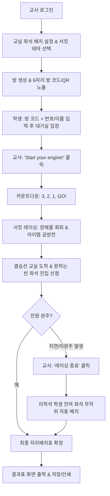

# 🏎️ 레이싱 자리바꾸기 (Racing Seat-Change Program) 기획 및 개발 사양서

> **"교실 자리 바꾸기를 흥미진진한 카트 레이싱 배틀로!"**  
> 학생들이 카트를 몰아 다양한 테마 서킷과 기믹을 뚫고, 결승선 교실의 원하는 자리에 먼저 주차(입장)하여 자리를 차지하는 실시간 멀티플레이어 웹 프로그램입니다.

---

## 📌 1. 프로그램 개요

* **목적**: 딱딱하고 단순한 제비뽑기/랜덤 자리배치를 대신하여, 학생들의 몰입도와 재미를 극대화하는 교실 참여형 자리바꾸기 프로그램
* **플랫폼**: 반응형 웹 애플리케이션 (Web)
  * **교사**: PC 화면 / 전자칠판 / 빔프로젝터 송출
  * **학생**: 학교 크롬북(키보드) 및 스마트폰/태블릿(화면 가상 조이스틱 모드 지원)
* **시점 및 그래픽**: 탑뷰(Top-down View, 2D) 기반의 부드럽고 생동감 있는 그래픽

---

## 🎮 2. 게임 진행 흐름 (Flow)



### 단계별 상세 시나리오
1. **사전 준비 (Teacher Setup)**
   * 교사가 원하는 **교실 자리 배치(좌석 행/열, 분단 형태 등)**를 시각적으로 편집하고 저장/불러옵니다.
   * 오늘 플레이할 **서킷 테마(6종 중 택1)**를 선택하고 게임 방을 생성합니다.
2. **학생 입장 (Lobby)**
   * 교사 화면에 큼직한 **방 코드(또는 QR 코드)**가 표시됩니다.
   * 학생들은 크롬북/스마트폰으로 접속하여 방 코드, 출석 번호, 이름을 입력하고 입장합니다.
3. **스타트 (Start Your Engine!)**
   * 교사가 **"Start your engine!"** 버튼을 누르면 강렬한 엔진 배기음과 함께 `3, 2, 1, GO!` 카운트다운이 시작됩니다.
4. **레이싱 & 아이템 배틀 (Racing)**
   * 학생들은 각 테마별 개성 있는 서킷을 질주합니다.
   * 코스 곳곳에 배치된 기믹 장애물과 랜덤 아이템 상자를 활용해 역전을 노립니다.
5. **골인 & 자리 선점 (Goal & Seating)**
   * 서킷 끝에 위치한 결승선(교실 입구)을 통과하면 교사가 설정해둔 교실 좌석 배치가 나타납니다.
   * **한 면이 열린 정사각형 좌석(디귿자 구조)**의 열린 입구로 카트가 먼저 진입하면, 해당 자리는 그 학생의 이름/번호로 **즉시 잠금(선점)**됩니다.
   * 이미 선점된 자리는 입구가 닫히며 다른 학생은 진입할 수 없습니다.
6. **교사 권한: 레이싱 종료 및 미착석자 자동 배정 (Anti-Trolling)**
   * 고의로 완주하지 않거나 지연시키는 행위를 방지하기 위해, 교사는 언제든 **[🏁 레이싱 종료]** 버튼을 누를 수 있습니다.
   * 교사가 레이싱을 종료하면, **아직 자리를 잡지 못한 학생들은 남아 있는 빈 좌석에 무작위(Random)로 자동 배치**됩니다.
7. **최종 결과 (Finished)**
   * 전원 착석 완료 시 축하 팡파르와 함께 완성된 **최종 학급 자리배치표**가 화면에 깔끔하게 정리되어 출력(인쇄 및 이미지 저장 가능)됩니다.

---

## 🖥️ 3. 디바이스 및 조작 시스템

### 1) 학생 조작 방식
* **기본 모드 (크롬북 / PC)**:
  * 키보드 방향키(`↑`, `↓`, `←`, `→`) 또는 `WASD` 키를 이용한 직관적인 카트 운전
* **휴대폰 버전 (모바일 / 태블릿 터치 모드)**:
  * 화면 상단 **[📱 휴대폰 버전]** 토글 버튼 제공
  * 클릭 시 화면에 **가상 D-Pad(또는 아날로그 스틱)** 및 **가속(액셀)/후진(브레이크)** 터치 버튼이 오버레이로 활성화되어 스마트폰에서도 완벽 조작 지원

### 2) 화면별 차별화 기능
| 구분 | 교사 화면 (호스트 / 옵저버) | 학생 화면 (플레이어) |
| :--- | :--- | :--- |
| **화면 목적** | 빔프로젝터/전자칠판용 전체 중계 화면 | 개별 조작 및 레이싱 몰입 화면 |
| **시야 (Field of View)** | **전체 서킷 조망 (Full Map)** | **제한된 시야 (Fog of War / 스포트라이트)** |
| **시야 제한 목적** | 학생들의 전체 진행 상황 관전 및 중계 | 미로 탐색의 긴장감 부여 & 네트워크 트래픽 절감 |
| **카메라 제어** | **마우스 휠 줌인/줌아웃**, 드래그 패닝 | 내 카트 중심 자동 스무스 트래킹 카메라 |
| **관리자 기능** | 레이스 시작, **레이싱 강제 종료(미착석자 잔여석 무작위 자동 배치)**, 자리 리셋, 결과표 내보내기 | 자리 선점 시 "착석 완료!" 피드백 및 관전 모드 전환 |

---

## 🪑 4. 교실 자리 배치 커스텀 시스템 (Seat Builder)

교사가 원하는 우리 반 고유의 교실 형태를 사전에 완벽하게 구성할 수 있습니다.

* **좌석 그리드 편집기 (Grid Editor)**:
  * 최대 8×8 등의 격자판에서 클릭 한 번으로 좌석을 **활성화/비활성화(빈 공간/통로)** 처리
  * 분단형 (2-2-2 분단, 1인 1책상, ㄷ자형 토론 배치, 모둠형 등) 프리셋 원클릭 적용
* **저장 및 불러오기 (Local Preset Storage)**:
  * "1분단 짝꿍 배치", "시험 대형", "ㄷ자 토론 대형" 등 프리셋 이름으로 로컬 저장 및 즉시 로드
* **좌석 물리 메커니즘**:
  * 각 좌석은 한 면만 뚫린 디귿자(ㄷ) 벽 구조 (예: 교탁을 바라보도록 아래쪽이 열림)
  * 카트의 중심점이 열린 입구를 통해 좌석 내부 감지 영역에 진입하면 즉시 서버에 선점 패킷 전송
  * 먼저 도착한 1인만 확정되며, 즉시 좌석 입구에 바리케이드가 쳐지며 학생 번호와 이름이 박스에 고정 표시됨

---

## 🏎️ 5. 카트 & 캐릭터 라인업 (5종)

각 테마 서킷과 찰떡궁합을 이루는 5종의 개성 넘치는 탑뷰 카트 & 캐릭터입니다. 학생들은 입장 시 원하는 캐릭터를 선택(또는 랜덤 배정)받아 출전합니다.

| 번호 | 캐릭터명 | 테마 매칭 | 비주얼 특징 및 탑뷰 컨셉 |
| :---: | :--- | :--- | :--- |
| **1** | **🏁 스피드 레이서**<br>(Speed Racer) | 정통 레이싱장 | 날렵한 붉은색 스포츠 포뮬러 카트(넘버 1), 교복을 입은 갈색 단발머리 학생 드라이버 |
| **2** | **🌌 코스모 라이더**<br>(Cosmo Rider) | 우주 정거장 | 미래형 블랙 & 네온 청록 사이버네틱 카트, 부스터 엔진, 우주비행사 헬멧 |
| **3** | **❄️ 윈터 펭귄**<br>(Winter Penguin) | 얼음왕국 | 눈꽃 문양이 새겨진 하늘색 스노우 카트, 귀여운 펭귄 모자를 쓴 방한복 학생 |
| **4** | **⚔️ 글래디에이터**<br>(Gladiator) | 고대 콜로세움 | 고대 로마 신전 기둥과 방패, 가시 휠을 장착한 석조 전차, 황금 투구의 검투사 |
| **5** | **✏️ 펜슬 스칼라**<br>(Pencil Scholar) | 교실 어드벤처 | 노란 연필과 우든 바디, 지우개 범퍼 카트, 손에 자를 쥐고 있는 스마트한 단정 학생 |

---

## 🗺️ 6. 서킷 테마 6종 (Circuit Themes)

교사가 방을 만들 때 원하는 분위기의 서킷을 자유롭게 선택할 수 있습니다.

| 번호 | 테마명 | 배경 및 비주얼 컨셉 | 고유 기믹 및 장애물 |
| :---: | :--- | :--- | :--- |
| **1** | **🏁 정통 레이싱장**<br>(Classic Circuit) | 아스팔트 트랙, 체크무늬 연석, 관중석 함성소리 | 타이어 장벽, 미끄러운 오일 슬릭(순간 스핀) |
| **2** | **✏️ 교실 어드벤처**<br>(Classroom Adventure) | 거대해진 교실 바닥, 책상 다리, 공책과 필통 사이 질주 | 지우개 장애물, 엎질러진 우유(미끄러짐), 자/각도기 가드레일 |
| **3** | **🌌 우주 정거장**<br>(Outer Space) | 어두운 심우주, 네온 발광 트랙, 소행성대와 성운 | 회전하는 우주 파편, 밟으면 초가속되는 워프 패드 |
| **4** | **🏛️ 유럽 도시**<br>(European City) | 고풍스러운 돌바닥(코블스톤), 클래식 가로등, 분수 광장 | 분수대 로터리, 좁은 골목길 분기점, 야외 카페 테라스 |
| **5** | **⚔️ 고대 콜로세움**<br>(Ancient Colosseum) | 웅장한 원형 경기장 모래사장, 돌기둥, 불타는 횃불 | 무너진 대리석 기둥 잔해, 불타는 바닥(감속 트랩) |
| **6** | **❄️ 얼음왕국**<br>(Ice Kingdom) | 푸른 빙판 트랙, 눈 덮인 침엽수, 반짝이는 고드름 | 드리프트 시 미끄러지는 빙판 마찰력, 굴러오는 눈덩이 |

---

## ⚡ 7. 장애물 및 아이템 시스템

* **일반 지형/장애물**:
  * 고정 벽/기둥: 충돌 시 튕겨남 및 속도 리셋
  * 감속 영역(모래, 진흙, 잔디): 진입 시 주행 속도 50% 저하
* **기믹 아이템 상자 (? Box)**:
  * 서킷 주요 지점에 배치되어 통과 시 랜덤 아이템 발동
  * **💫 멘붕 혼란 (Confuse)**: 3초 동안 **좌/우 방향키 조작이 정반대로 반전**
  * **🌀 운명 교환 순간이동 (Teleport Swap)**: 
    * 아직 자리를 잡지 못한 **무작위 다른 학생 카트와 내 카트의 위치가 즉시 맞바뀜**
    * ⚠️ *단, 이미 결승선 교실 좌석에 안착한 학생은 타겟에서 절대 제외*
  * **🚀 터보 부스터 (Booster)**: 2초간 폭발적인 가속 질주
  * **🛡️ 쉴드 (Shield)**: 다음 1회의 장애물 충돌 또는 혼란 디버프 방어

---

## 🏗️ 8. 시스템 아키텍처 및 기술 스택

### 1) 기술 스택 (Tech Stack)
* **프론트엔드 (Frontend)**: 
  * **React / Next.js** (또는 Vite + React) + **TypeScript**
  * **HTML5 Canvas 2D Engine**: 부드러운 60FPS 렌더링, 플레이어 추적 카메라, 안개(Fog of War) 마스킹
  * **Tailwind CSS**: 세련된 레이싱 다크모드 대시보드 및 반응형 UI
* **백엔드 & 실시간 데이터베이스 (Backend / BaaS)**:
  * **Firebase Realtime Database (RTDB)**:
    * 학생 좌표(x, y, angle) 초저지연 브로드캐스팅
    * 좌석 선점 경쟁 시 `transaction()`을 통한 안전한 원자적(Atomic) 선점 처리
  * **Firebase Authentication**: 교사 간편 로그인 (Google 로그인 / 익명 교사 로그인)
* **배포 & 운영 (Hosting & Deployment)**:
  * **Vercel**: GitHub 저장소 연동을 통한 글로벌 엣지(Edge) 무중단 자동 CI/CD 배포
* **버전 관리 (Version Control)**:
  * **GitHub**: 모듈화된 프로젝트 코드베이스 및 이슈 관리

---

## 📊 9. Firebase Realtime Database 데이터 스키마 설계

```json
{
  "rooms": {
    "ROOM_CODE_123456": {
      "hostTeacherUid": "teacher_abc123",
      "status": "LOBBY | COUNTDOWN | RACING | FINISHED",
      "circuitTheme": "racing | space | ice | colosseum | classroom | europe",
      "countdown": 3,
      "createdAt": 1726750000,
      
      "seatConfig": {
        "rows": 5,
        "cols": 6,
        "seats": {
          "seat_0_0": { "active": true, "occupiedBy": null, "studentName": null, "studentNumber": null },
          "seat_0_1": { "active": true, "occupiedBy": "player_id_1", "studentName": "김철수", "studentNumber": 1 }
        }
      },
      
      "players": {
        "player_id_1": {
          "number": 1,
          "name": "김철수",
          "characterId": "speed_racer",
          "x": 120.5,
          "y": 450.2,
          "angle": 90,
          "speed": 0,
          "isSeated": false,
          "seatedId": null,
          "activeEffect": "confuse | shield | booster | null",
          "effectEndTime": 0,
          "lastActive": 1726750005
        }
      },
      
      "items": {
        "item_01": { "type": "box", "x": 500, "y": 300, "respawnAt": 0 }
      }
    }
  }
}
```

---

## 🔒 10. 동시성 & 안전성 설계 (Race Condition Prevention)

1. **원자적 좌석 선점 (`RTDB Transaction`)**:
   * 학생 카트가 좌석 입구를 통과하는 순간, `rooms/{roomCode}/seatConfig/seats/{seatId}` 경로로 Firebase 트랜잭션을 실행합니다.
   * `occupiedBy === null`인 경우에만 해당 학생 ID로 잠금(Lock)을 걸고, 이미 값이 존재하면 실패(Reject) 처리하여 물리적 반사(튕겨남) 피드백을 제공합니다.
2. **교사의 비상 레이싱 강제 종료 (`Finish Race`)**:
   * 교사가 버튼을 누르면 서버/클라이언트 컨트롤러가 즉시 잔여 빈 좌석 목록과 미착석 학생 목록을 셔플(Shuffle) 매칭하여 단 1회의 트랜잭션/배치 업데이트로 모든 자리를 일괄 확정합니다.
